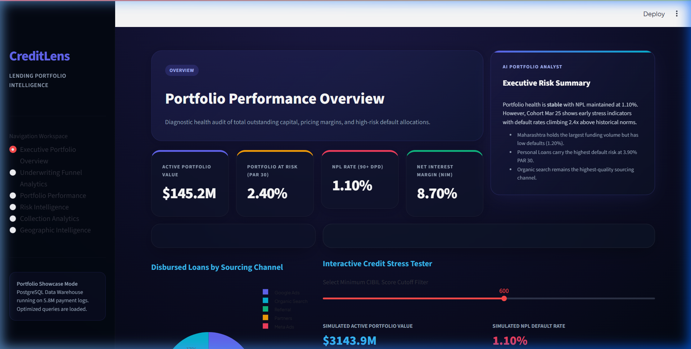
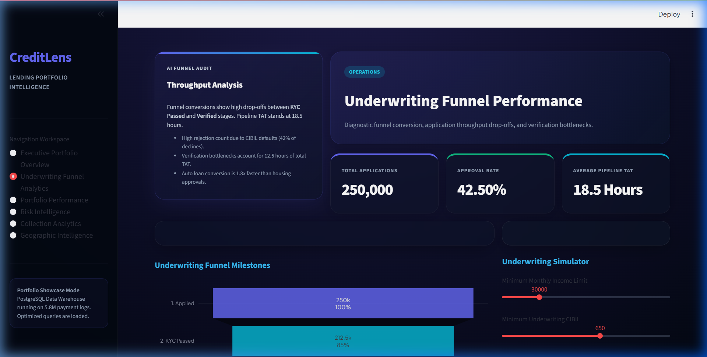
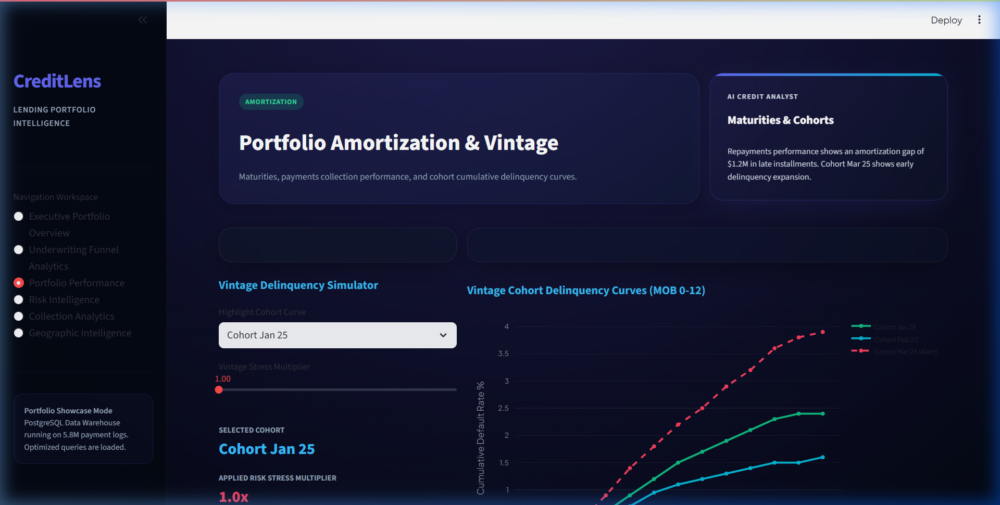
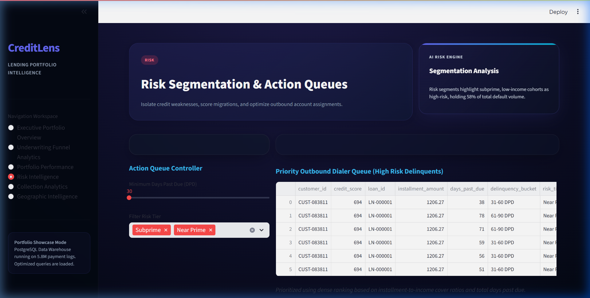
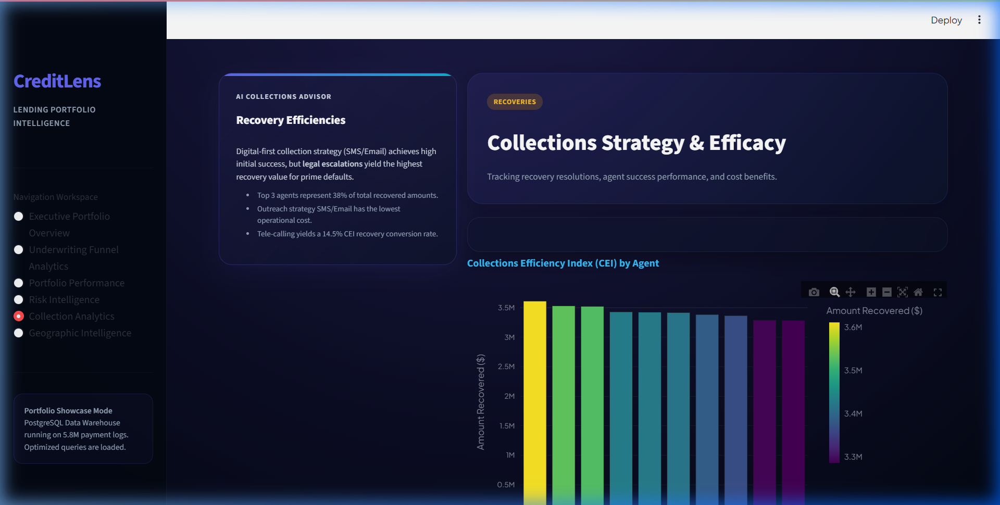
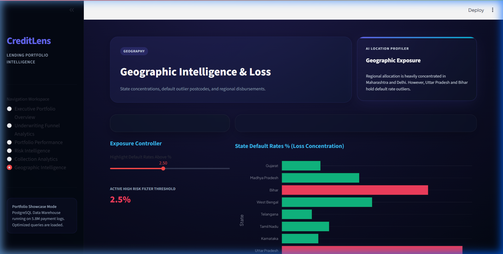

# CreditLens – Loan Portfolio Intelligence & Risk Analytics Platform

<p align="center">
  
  
  
  
</p>

---

## Overview
CreditLens is an industry-grade, end-to-end data analytics and business intelligence platform built for digital lenders, fintechs, and NBFCs. The project establishes a structured PostgreSQL data warehouse, models synthetic datasets reflecting real-world portfolio risks, executes complex analytical queries, and designs executive interactive dashboards to track growth and credit risk.

---

## Project Organization & Repository Structure

```
creditlens-lending-analytics/
├── data_warehouse/
│   ├── ddl/
│   │   └── create_schema.sql         # PostgreSQL DDL script
│   └── raw_csvs/
│       └── .gitkeep                  # Landing directory for raw mock CSVs
├── scripts/
│   ├── data_generator.py             # Python synthetic data script
│   └── db_uploader.py                # Ingests CSVs into PostgreSQL
├── sql_queries/
│   ├── module1_funnel.sql            # Funnel queries
│   ├── module2_vintage.sql           # Vintage queries
│   ├── module3_portfolio.sql         # Portfolio queries
│   ├── module4_risk.sql              # Risk segmentation queries
│   ├── module5_channel.sql           # Channel queries
│   ├── module6_collections.sql       # Collections queries
│   └── module7_geography.sql         # Geographic queries
├── dashboards/
│   └── layouts_and_dax_measures.md   # DAX formulas and wireframes
├── reports/
│   └── executive_business_report.md  # Executive Insights Report
├── docs/
│   ├── data_dictionary.md            # Warehouse data dictionary
│   └── page1_overview.png            # Dashboard Screenshots...
├── requirements.txt                  # Python dependencies
└── README.md                         # Main portfolio landing page
```

---

## Data Warehouse Architecture & Schema
The data warehouse features a clean star schema with 5 Dimension tables and 5 Fact tables optimized for aggregate analytical lending queries:
*   **Dimensions:**
    *   `dim_customer`: Demographics, income, employment type, and risk tiers.
    *   `dim_date`: Enterprise date mapping for calendar aggregations.
    *   `dim_loan_product`: Product parameters, tenure, and APR interest rates.
    *   `dim_location`: Geographic dimensions (city, state, region).
    *   `dim_channel`: Acquisition channels (sourcing and campaign details).
*   **Facts:**
    *   `fact_application`: Funnel entry records.
    *   `fact_approval`: Underwriting decision states.
    *   `fact_disbursement`: Capital funding events.
    *   `fact_repayment`: Amortization schedule ledger, tracking outstanding principal, past-due days, delinquency buckets, and default states.
    *   `fact_collection`: Recovery actions, strategy success, and collections outcomes.

---

## Key Business Questions Solved
1.  **Which acquisition channels bring the most profitable borrowers?**
    *   *Finding:* Referral and Organic Search bring the lowest default rates (0.75%) and highest net yield, while digital affiliate Partners bring volume but high default rates (3.8% NPL) and high CAC.
2.  **Which customer segments default the most?**
    *   *Finding:* Freelancer/Self-Employed accounts and borrowers with credit scores <650 (Subprime).
3.  **What is the underwriting funnel conversion flow?**
    *   *Finding:* Overall funnel conversion sits at 40%, with a primary drop-off bottleneck at the Risk/Employment Verification stage (30% loss of remaining pipeline).
4.  **Which cities and states generate the highest credit losses?**
    *   *Finding:* Uttar Pradesh (UP) has the highest default rate (4.20% NPL), while Noida and Lucknow represent postcode-level default outliers.
5.  **How much money is currently past due and at risk?**
    *   *Finding:* PAR 30 is 2.40% ($3.48M outstanding) and total NPL exposure is $1.6M out of a $145.2M portfolio.

---

## Interactive Dashboard Showcases

### Page 1: Executive Portfolio Overview
*Provides the C-suite with an immediate, high-level pulse on overall portfolio health, growth, and credit risk thresholds.*


### Page 2: Underwriting Funnel Analytics
*Analyze application throughput speeds, funnel conversion milestones, and decline drivers.*


### Page 3: Portfolio Performance
*Track cohort asset behaviors, payment maturities, and vintage default rates over months on book.*


### Page 4: Risk Intelligence
*Isolate credit weaknesses, track DPD migrations, and optimize outbound account assignments.*


### Page 5: Collection Strategy & Efficacy
*Track recovery resolutions, agent success performance, and channel outreach cost benefits.*


### Page 6: Geographic Intelligence
*Analyze geographic portfolio concentration, state volumes, and postcode outlier risks.*


---

## Installation & Usage Guide

### Prerequisites
*   Python 3.10+
*   PostgreSQL 14+ database instance running locally or remotely

### Step 1: Install Dependencies
```bash
pip install -r requirements.txt
```

### Step 2: Set Up Database Schema
Run the PostgreSQL DDL script to create the dimension and fact tables:
```bash
psql -h localhost -U postgres -d postgres -f data_warehouse/ddl/create_schema.sql
```

### Step 3: Run the Synthetic Data Generator
Execute the Python script to simulate and generate the CSV tables in `data_warehouse/raw_csvs/`:
```bash
python scripts/data_generator.py
```

### Step 4: Import Data into PostgreSQL
Run the DB uploader script to load the generated CSV files into their respective SQL tables:
```bash
python scripts/db_uploader.py
```

### Step 5: Launch the Interactive Dashboard
To launch the interactive dashboard locally:
```bash
streamlit run app.py
```
